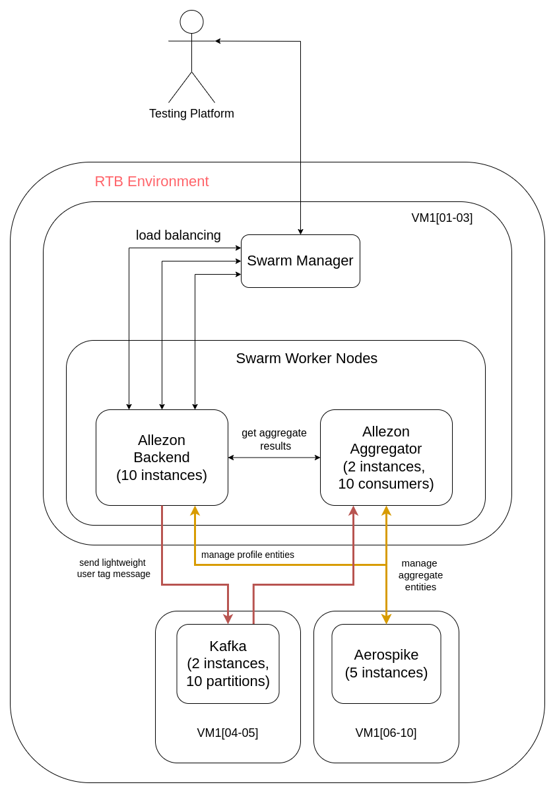

# allezon

## Setup (on RTB machines)

### Prerequisites

- Java 17
- Maven 3.6.3
- Docker 26.1.2 with DockerHub account
- Redeployed RTB machines

### Deployment Steps

1. Login to main host and kafka host
2. Fill the .env file with your credentials
3. Run deploy script

```bash
chmod u+x deploy_allezon.sh
./deploy_allezon.sh
```

## Architecture

This is the high-level architecture of the system that performed
best among all the tested configurations. You can easily change the number of instances
of each service by changing `hosts` files and `application.properties` accordingly.



## Results

Some of the (most sensible) configurations we have tested:

| Swarm nodes | Kafka | Aerospike | Profiles compression | User Profile Score | Aggregate Score |
|-------------|-------|-----------|----------------------|--------------------|-----------------|
| 4           | 2     | 4         | FALSE                | 88.37              | 82.10           |
| 3           | 2     | 5         | FALSE                | 99.94              | 80.44           |
| 3           | 2     | 5         | TRUE                 | 100.00             | 99.71           |
| 4           | 2     | 4         | TRUE                 | 94.82              | 93.99           |

After testing various configurations, we found that our worst bottleneck was the amount of storage used by our services.
Initially, we added new Aerospike nodes, but unfortunately, it didn't help much, and we didn't want to reduce the nodes
of any service. So, we decided to compress the profiles, which helped significantly. However, it's still not enough to
have only four Aerospike nodes. Screenshots of the results are available in the `images` directory.

Authors: Hubert Michalski & Aleksander Bloch